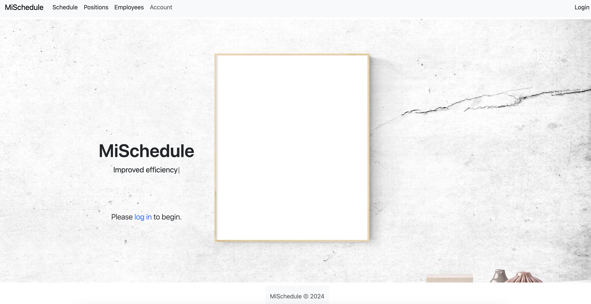
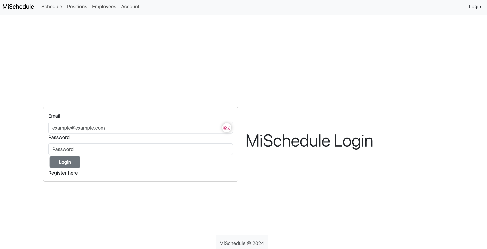

# MiSchedule

## Table of Contents

* [Description](#description)
* [Live-URL](#live-url)
* [Screenshots](#screenshots)
* [Technologies-Used](#technologies-used)
* [Installation](#installation)
* [Credits](#credits)
* [Features](#features)
* [Usage-Information](#usage-information)
* [Suggested-Future-Development](#suggested-future-development)
* [Contribution-Guidelines](#contribution-guidelines)
* [Test-Instructions](#test-instructions)
* [License](#license)
* [Questions](#questions)

## Description

MiSchedule is a Customer relationship management (CRM) platform with the intent to streamline your scheduling for your company. MiSchedule offers the ability to manage employees, roles, and schedules with the greatest of ease.

My wife and I had our first child during the creation of this app, and as such, I have not been able to resolve a few issues, mainly the jwt token issue, which should be resolved hopefully shortly

## Live-URL

[Link to live URL](TBD)

## Screenshots

## Technologies-Used

This application was created using the MERN stack along with:

* Bcrypt
* JSON Web Tokens
* Apollo GraphQL
* GraphQL
* Mongoose
* NodeMon
* React-Bootstrap
* Moment.js
* ESLint

## Installation

1. Using Git Bash or Terminal, clone the repository.
2. Change Directory to the repo folder and run command `code .` to launch the repo in VS Code
3. Ensure that you have Node.js installed, and run the command `NPM Install` in the root directory for the repo to install all required dependencies
4. Ensure that you have MongoDB and MongoDB compass installed
5. run command `NPM Run Develop` run database and client side

## Credits

This was created by myself, and with the help of ChatGPT

## Features

WIP

## Usage-Information

WIP

## Suggested-Future-Development

WIP

## Contribution-Guidelines

Open to collaboration, if you choose to do so open an issue and modify any changes you would like to see on a feature branch and wait for approval before merging to the main branch.

## Test-Instructions

There is currently no unit testing written for this application.
***FAKER***

## License

NOTICE: This application is covered under the MIT License

## Questions

Have additional questions? Click the links below to us reach us through GitHub or Email.

Digitally Intrinsic: [Link to Github](https://github.com/digitallyintrinsic) Email:[gitboot@1002.us](mailto:gitboot@1002.us)
